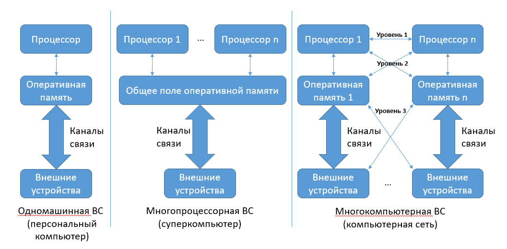
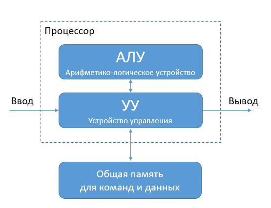
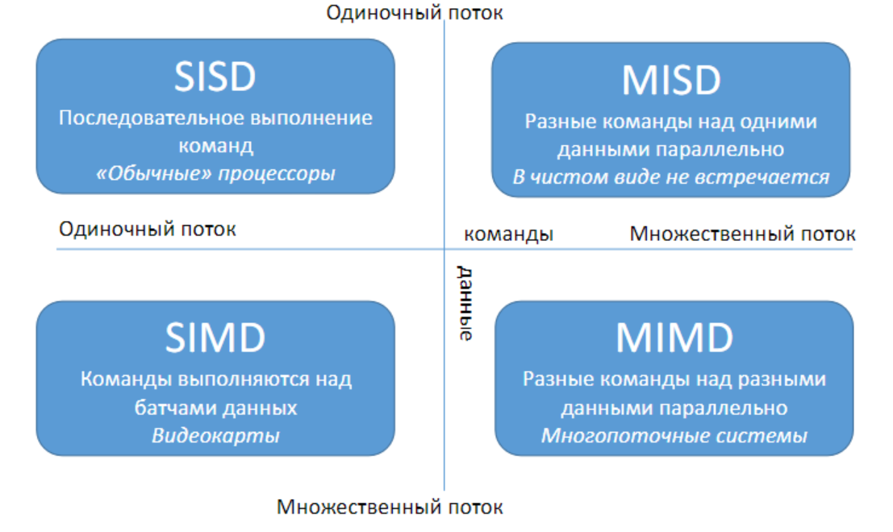
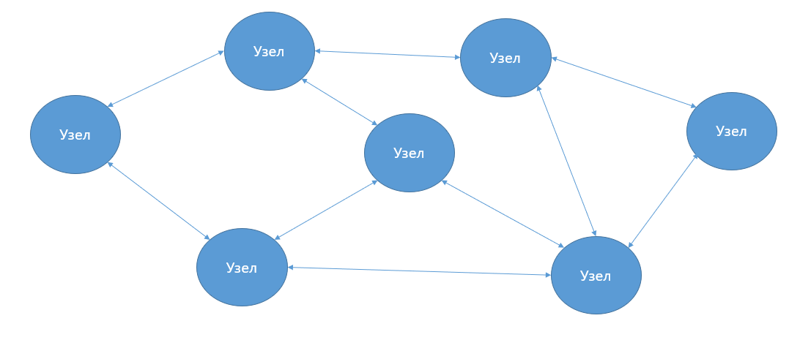
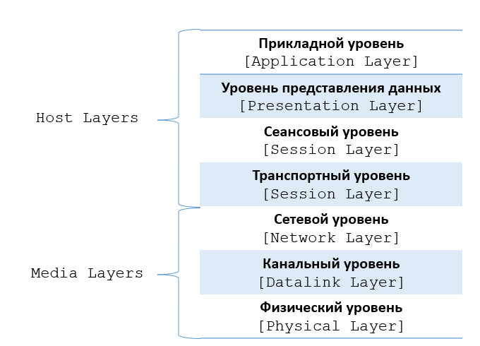
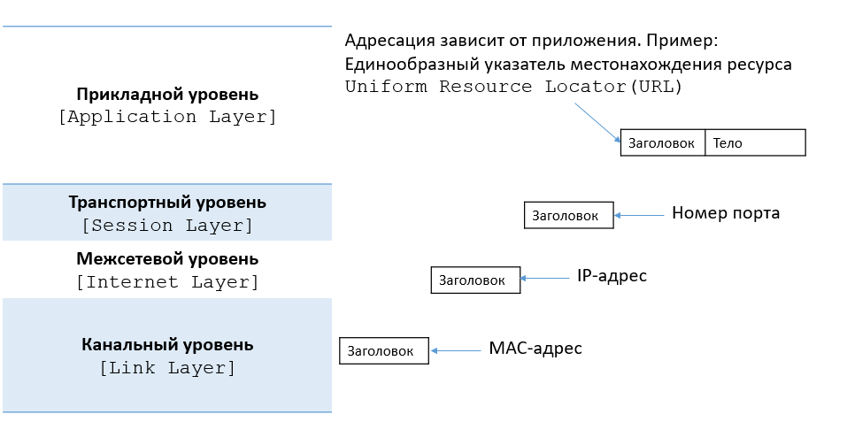

# Вычислительные системы
### Основные определения
- **Система** — это совокупность элементов, взаимодействующих друг с другом, образующих определенную целостность, единство. 
- **Элемент системы** — часть системы, имеющая определенное функциональное назначение. Сложные элементы систем, в свою очередь состоящие из более простых взаимосвязанных элементов, часто называют подсистемами.
- **Вычислительная система** — совокупность одного или нескольких компьютеров или процессоров, программного обеспечения и периферийного оборудования, организованная для совместного выполнения информационно-вычислительных процессов.
- Системы делят на материальные и абстрактные. Вычислительная система является материальной. 

### История вычислительных систем
1) **1950-60-е** 
	Компьютер как вычислительная машина, т.е. единое устройство, используемое для вычислений 

2) **1970-е** 
	Компьютер как вычислительные система, т.е. совокупность устройств, используемая для вычислений 
	Один процессор – много терминалов 
	
	«Умный терминал» – по сути менее мощный компьютер, взаимодействующий с основным
	
	 Разделение времени между процессами 

3) **1980-е и далее** 
	Компьютер как информационная система, т.е. совокупность устройств, используемая для обработки информации в широком смысле
	
	Принципы вычислительных систем переродились в использование серверных и облачных мощностей

### Виды вычислительных систем
- **Однородные** (составлены из одинаковых устройств) и **неоднородные** (составлены из разнообразных устройств) 
- **Оперативные** `[online]` (взаимодействие устройств в реальном времени) и **неоперативные** `[offline]` (возможны существенные задержки)
- **Территориально-сосредоточенные** и **распределенные**
- **одноуровневые** и **многоуровневые** (или **иерархическими**; в таких системах функции разных устройств могут отличаться)
- **Одномашинные** (один процессор + много периферии), **многопроцессорные** (несколько процессоров в рамках одного компьютера с общей операционной системой) и **многомашинные** (составлены из отдельных устройств)

# Архитектура вычислительных систем
### Гарвардская архитектура
**Гарвардская архитектура** предполагает раздельное использование памяти программ и данных. Обычно такую архитектуру используют для повышения быстродействия системы за счет разделения путей доступа к памяти программ и данных. 

Большинство специализированных МП (особенно микроконтроллеры) имеют данную архитектуру.

**Гарвардская архитектура** несколько удорожает конструкцию вычислителя, делает ее менее гибкой, однако, основным преимуществом ее становится скорость обработки данных.
### Принстонская архитектура (aka Фон-Неймана)
Антипод гарвардской – **архитектура фон Неймана** (Принстонская архитектура) предполагает хранение программ и данных в общей памяти. Данная архитектура наиболее характерна для МП, ориентированных на использование в компьютерах. Примером могут служить МП семейства x86

# Классификация по Флинну
Одним из наиболее распространенных способов классификации ЭВМ является систематика Флинна (Flynn), в рамках которой основное внимание при анализе архитектуры вычислительных систем уделяется способам взаимодействия последовательностей (потоков) выполняемых команд и обрабатываемых данных. В результате такого подхода различают следующие основные типы систем

- **SISD** (Single)nstruction, Single Data) – системы, в которых существует одиночный поток команд и одиночный поток данных; Это традиционный компьютер фон-Неймановской архитектуры с одним процессором, который выполняет последовательно одну инструкцию за другой, работая с одним потоком данных. В данном классе не используется параллелизм ни данных, ни инструкций, и, следовательно, SISD-машина не является параллельной. К этому классу также принято относить конвейерные, суперскалярные и VLIW-процессоры.
- **SIMD** (Single Instruction, Multiple Data) – системы c одиночным потоком команд и множественным потоком данных; Типичными представителями SIMD являются векторные процессоры, обычные современные процессоры, когда работают в режиме выполнения команд векторных расширений, а также особый подвид с большим количеством процессоров — матричные процессоры.
- **MISD** (Multiple Instruction, Single Data) – системы, в которых существует множественный поток команд и одиночный поток данных; примеров конкретных ЭВМ. К классу MISD ряд исследователей относит конвейерные ЭВМ, однако это не нашло окончательного признания. Также, возможно считать MISD системами, системы с горячим резервированием. Помимо этого, к архитектуре MISD некоторые относят систолические массивы процессоров. 
- **MIMD** (Multiple Instruction, Multiple Data) – системы c множественным потоком команд и множественным потоком данных. Класс MIMD включает в себя многопроцессорные системы, где процессоры обрабатывают множественные потоки данных. Сюда принято относить традиционные мультипроцессорные машины, многоядерные и многопоточные процессоры, а также компьютерные кластеры.

# Архитектуры взаимодействия
### «Клиент—Сервер»
In client-server architectures, processes are divided into two (sometimes overlapping) groups: servers and clients

A **server** is a process that implements a specific service.
A **client** is a process that uses a server’s service by sending it a request and waiting for a response

**Пример:** REST, электронная почта

### «Издатель—брокер—подписчик» (aka pub/sub)
Pub/sub представляет собой платформу для обмена сообщениями между издателями, которые создают и отправляют сообщения и подписчиками, которые их получают. При этом издатели не отправляют сообщения подписчикам напрямую в режиме «точка-точка». Вместо этого используется посредник — брокер, который группирует сообщения в сущности, называемые топиками или темами.

**Брокер** — узел, который организует работу топиков (может отсутствовать)

**Пример:** Apache Kafka

### «Peer-to-peer» (одноранговая сеть)
Одноранговые архитектурные шаблоны принадлежат к категории симметричных шаблонов «Клиент-сервер». Симметричность в данном контексте означает отсутствие в сети подразделения на клиентов и серверы. В этом шаблоне одна система выступает и как клиент, и как сервер.  
  
Каждая система, также называемая пиром, отправляет запросы другим пирам сети и в то же время получает и обслуживает запросы от других пиров этой сети. Такая схема сильно отличается от традиционной клиент-серверной сети, в которой клиент должен только отправлять запрос и ожидать его обработки сервером.

**Пример:** I2P, файлообменные сети, блокчейн

# Модель OSI

**Сетевая модель OSI** (The Open Systems Interconnection model) — сетевая модель стека сетевых протоколов OSI/ISO. Посредством данной модели различные сетевые устройства могут взаимодействовать друг с другом.

Семиуровневая эталонная сетевая модель взаимодействия открытых систем `[Open Systems Interconnection]`

Модель OSI соответствует принципу абстракции: слои ничего не знают об устройстве друг друга, что позволяет им эволюционировать не затрагивая другие уровни. 
Слои: 
1. **Физический**. Работа со средой передачи, сигналами и двоичными данными. Реализуется в концентраторах и репитерах.
2. **Канальный**. Физическая адресация (MAC-адрес). Реализуется в сетевом мосте, коммутаторе, точке доступа. Данные на этом слое именуются фрэймами. 
3. **Сетевой**. Определение маршрута и логическая адресация (IP адрес). Реализуется в маршрутизаторе, сетевом шлюзе, межсетевом экране. Слой оперирует пакетами. 6 Department of Defense – Министерство обороны США 11 11 Изм. № докум. Подп. Дата 
4. **Транспортный**. Прямая связь между конечными пунктами. Реализовано в ядре ОС. Данные обернуты в сегменты и датаграммы.
5. **Сеансовый**. Управление сеансом связи. 
6. **Уровень** представления. Представление и шифрование данных.
7. **Прикладной**. Доступ к сетевым службам 

### Текущее состояние 
Модель оказалось избыточной, а в некоторых моментах нереализуемой, поэтому она не получила поддержку архитекторов на заре Интернета, который впоследствии был устроен по модели TCP/IP уже под эгидой Инженерного совета Интернета. В настоящее время OSI позиционируется как эталон и используется только для обучения устройству сетей, на практике не применяется.

# Модель DoD. Стек протоколов TCP IP
**TCP/IP** — это стек протоколов, которые задают правила передачи данных по Сети. Название происходит от двух основных протоколов: TCP и IP.

 Модель, на которой реализован стек протоколов TCP/IP, именуется модель DoD (Department of Defense) из-за своего военного происхождения. Развитием TCP/IP занимается Инженерный совет Интернета IETF.

### История 
Парадоксально, но модель TCP/IP была разработана раньше OSI. А точнее, в 1978 году, когда “отец интернета” Винт Серф создал два основополагающих протокола TCP и IP, в честь которых и названа модель. А 1 января 1983 ARPANET перешла на TCP/IP, этот день считается днем рождения интернета.

Таким образом, DOD имело в своей основе уже существующие и рабочие протоколы, когда как OSI была эталоном, более трудным и дорогим в реализации. 

### Уровни
Стек протоколов рассредоточен по четырем слоям абстракции, в отличие от 7-уровневой модели OSI. Благодаря абстракции стек протоколов является независимым от физической среды передачи данных

Примеры протоколов на каждом уровне:
1) **Прикладной**: HTTP, DNS, FTP
2) **Транспортный**: TCP, UDP 
3) **Межсетевой**: IP
4) **Канальный**: Ethernet, WLAN 
### Сравнение с моделью OSI
Последние три уровня модели OSI заменены одним прикладным в TCP/IP, первые два – канальным. Также в отличие от OSI, TCP/IP не описывает физический уровень, что подразумевает более гибкий подход к выбору среды передачи (например, проводное/ беспроводное соединение).

В большинстве случаев работа происходит с сетевой моделью TCP/IP, однако так исторически сложилось, что номера слоёв используются из сетевой модели OSI. Например, **L7**-балансировщик, где L7 обозначает 7 уровень модели OSI.

### Луковица

Подобно луковице сообщение с каждым уровнем приобретает всё новый и новый оверхед. Таким образом, каждый протокол добавляет свой заголовок к данным и ко всем прыдущим заголовкам  

# Глобальный сеть

Чтобы разделять глобальную сеть и локальные, в английском языке используют разное написание: `Internet` (с большой буквы) для обозначения глобальной сети и `internet` — для локальных.  
### Коммутационное оборудование
- Коммутатор (switch) 
- Маршрутизатор (router)
- Повторитель (repeater)
- Концентратор (hub)
- Сетевой шлюз (gateway)

# Дополнительные материалы
- [Презентация](ref/lektsia_01_VVEDENIE.pdf)
- [Таксономия Флинна](ref/flynn.pdf)
- [Микропроцессоры](ref/Микропроцессоры.pdf)
- [Архитектуры взаимодействия](https://habr.com/ru/companies/ruvds/articles/699648/)